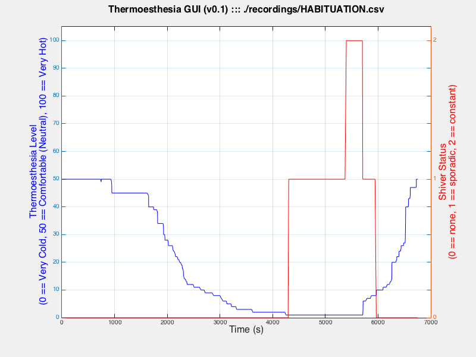
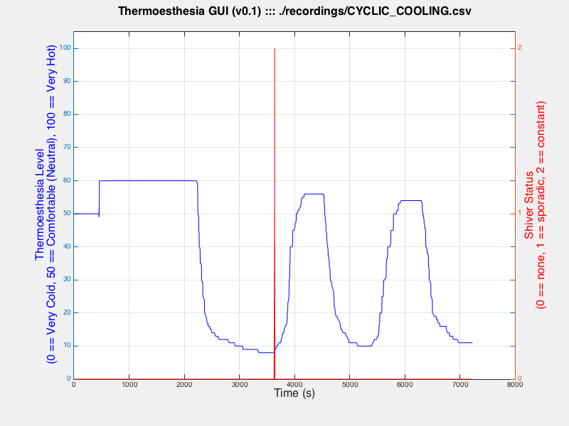

THERMOESTHESIA_GUI
==================
~~~~~
%
% THERMOESTHESIA_GUI(EXPERIMENT_NAME_STRING)
%
% Opens a Thermoesthesia GUI with figure title EXPERIMENT_NAME_STRING.
%
% If EXPERIMENT_NAME_STRING is not provided or is empty, it is set to TEST
%
% Starts a CSV file with name EXPERIMENT_NAME_STRING_YYYYMMDD_HHMMSS.csv
% in the ./recordings/ folder
%
% CSV file has three columns:
% 1. 's' : for seconds since GUI start (2 decimal places)
% 2. 'level' : integer marker level (integers 0 to 100) ('very cold' to 'very hot')
% 3. 'shiver' : shiver status (0=='none', 1=='sporadic', 2=='constant')
%
% Only button up events are recorded into the CSV file.
%
% One button is available to study personnel to start/pause recording.
%
% To start a new file, close the GUI and call again
%
% THERMOESTHESIA_GUI(EXPERIMENT_NAME_STRING)  
%
% Open GUI with custom parameter settings
%
% THERMOESTHESIA_GUI(EXPERIMENT_NAME_STRING, GUI_PARAMS)
%
% Return the name of the CSV filename used to store Thermoesthesia values
%
% CSV_FILENAME = THERMOESTHESIA_GUI(EXPERIMENT_NAME_STRING)
%
% GUI_PARAMS is a structure with the following fields and default values
%
% gui_params.marker_color = 'g';     % marker color
% gui_params.marker_alpha = 'g';     % marker alpha (transparency) 0.0 to 1.0
% gui_params.txt_fontsize = 16;      % font size for shivering status text
% gui_params.txt_fontname = 'Arial'; % font size for shivering status text
% gui_params.txt_color = 'b';        % font color for shivering status text
% gui_params.shiver_box_color = 'r'; % box (ellipse) color for shivering status
% gui_params.keys_dn = [ double('.37') 28 31 13]; % keys to mover marker down
% gui_params.keys_up = [ double('+48') 29 30];    % keys to mover marker up
% gui_params.keys_shiver = [ double('- 56')];     % keys to change shiver status
% gui_params.gui_timer_period_seconds = 30;   % seconds between auto logging to file
% gui_params.beep_on = true;   % flag to activate audible beep of shiver status (1, 2 or 3 beeps for 'none', 'sporadic' or 'constant')
%
% Developed with MATLAB R2014b
%
% Supported by a grant from the National Institutes of Health (NIH), National
% Institute of Diabetes and Digestive and Kidney Diseases (NIDDK) - R01DK105371
%
% Usage notes:
%
% * Be sure to click Thermoesthesia GUI window with mouse after beginning
%   to record so that button events move marker and shiver status box.
%
% Example:
%
%   % open figure black background to make Thermoesthesia GUI clearly visible
%   hf555 = figure(555); set(hf555,'Color',[0 0 0],'menubar','none');
%
%   % open Thermoesthesia GUI with default settings
%   Thermoesthesia_GUI('TEST');
%
~~~~~

THERMOESTHESIA_PLOT
===================
~~~~~
%
% [DATA_STRUCT] = THERMOESTHESIA_PLOT(CSV_FILENAME)
%
% Reads and plots a thermoesthesia data in CSV file CSV_FILENAME.
%
% DATA_STRUCT contains 3 fields which are column vectors of the same length
%
% data_struct.s      % time in seconds
% data_struct.level  % thermoestesia level (integers 0 to 100) ('very cold' to 'very hot')
% data_struct.shiver % shiver status (0=='none', 1=='sporadic', 2=='constant')
%
% Developed with MATLAB R2014b
%
% Supported by a grant from the National Institutes of Health (NIH), National
% Institute of Diabetes and Digestive and Kidney Diseases (NIDDK) - R01DK105371
%
% Example:
%
%   % open Thermoesthesia GUI with default settings
%   csv_filename = Thermoesthesia_GUI('TEST');
%
%   % plot thermoesthesia values
%   data_struct = Thermoesthesia_Plot(csv_filename);
%
~~~~~

Description
===========
Graphical user interface (GUI) to capture a human subject's perception and ability to distinguish differences of temperature (thermoesthesia). The tool use a graphic analog scale (Figure 1) to implement a MATLAB-based GUI (Figure 2) in which the subject controls a marker on the scale. The subject also indicated shivering status with a box/ellipse with options "None", "Sporadic" or "Constant". 

Figure 1. Thermoesthesia Scale
====================

Figure 2. GUI Screenshot
==============

Example Plots
=============

Habituation
-----------

Cyclic Cooling
--------------

Grant Support
-------------
Supported by a grant from the National Institutes of Health (NIH), National Institute of Diabetes and Digestive and Kidney Diseases (NIDDK) - R01DK105371
